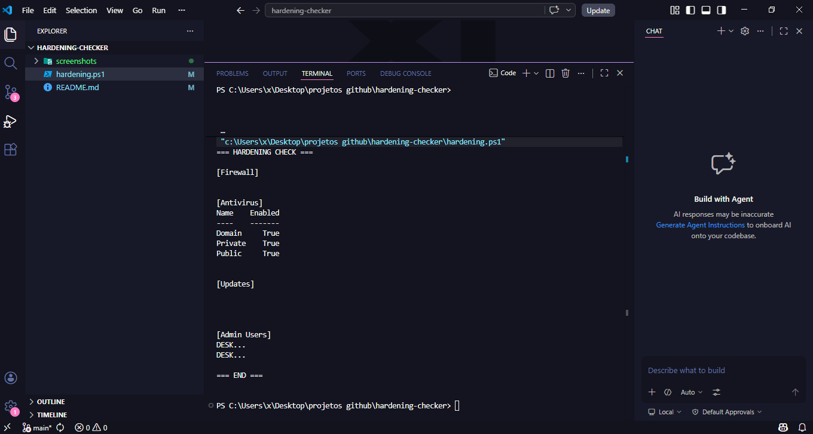

# 🛡️ Hardening Checker (Windows)

## 📌 Overview

This project is a basic security auditing script built with PowerShell.

It simulates a simple hardening checklist used in real-world environments to verify if a system meets minimum security requirements.

---

## 🔍 What it checks

* Firewall status
* Antivirus status
* Recent Windows updates
* Administrative users

---

## 🎯 Purpose

The goal of this project is to demonstrate:

* System hardening concepts
* Security baseline validation
* Basic automation in Windows environments

---

## ▶️ How to run

```powershell
Set-ExecutionPolicy Bypass -Scope Process
.\hardening.ps1
```

---

## 📊 Example Output

```
=== HARDENING CHECK ===

[Firewall]
Name    Enabled
Domain  True

[Antivirus]
AntivirusEnabled : True

[Updates]
...

[Admin Users]
Administrator

=== END ===
```

---

## 📸 Screenshot



---

## 🧠 Skills Demonstrated

* PowerShell scripting
* Security auditing basics
* Windows security concepts

---

## 📂 Project Structure

```
hardening-checker/
 ├── hardening.ps1
 ├── README.md
 └── screenshots/
     └── execution.png
```
